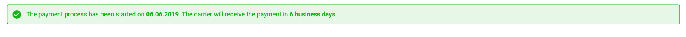
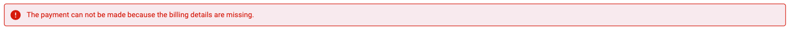
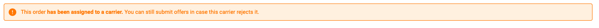

# Alert Message

## Props

| Name                      | Type    | Default value | descritpion                                            |
| ------------------------- | ------- | ------------- | ------------------------------------------------------ |
| type (required)           | string  |               | possible values: "success", "error", "warning", "info" |

## Success Alert Message

## Error Alert Message

## Warning Alert Message

## Info Alert Message

