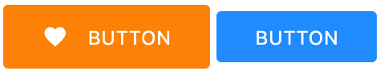

# Button

Please note `Button` adheres to the latest style guidelines (July 2019), as opposed to `BaseButton`.

## Props

| Name                      | Type    | Default value | Example                    |
| ------------------------- | ------- | ------------- | -------------------------- |
| disabled                  | boolean | false         |                            |
| text                      | string  | ''            |                            |
| materialIcon 1 | string  |               | 'cloud' for the cloud icon |
| inline 2       | boolean | false         |                            |
| category 3     | string  | 'primary'     | '°C'                       |

1 _Icons are from [material icons](https://material.io/resources/icons). Just pass a string with the icon name. If both `materialIcon` and `textIcon` are passed to the component, `textIcon` takes precedence._

2 _If `true` the button will display with a smaller `height`. From a design perspective this is intended to be used as part of text._

3 _Other options are `secondary` (for **blue** background) and `tertiary`_ (for **white** background).

## Slot

The button's text can also be added in a slot (see examples) but only one of those options should be used. If both `text` prop and a slot is provided, only the prop will be displayed.

## Usage

Here's a quick overview on how the component displays with certain parameters.
For a more detailed overview, run the Storybook locally.

### Important notes

For **Minions** simply pass in a `materialIcon` and no `text`.

### Examples

`<Button text="BUTTON" />`

`<Button>BUTTON</Button>`

> Both will display the same.

`<Button category="primary" text="BUTTON" materialIcon="favorite" @click="someMethod"/>`

`<Button category="secondary" :inline="true" text="BUTTON"/>`

will render:

> Notice the difference in `category`, `materialIcon` and `inline` (set to `true`) in the second component.

#### Minions

For _minions_, provide a `materialIcon` and do not provide any `text` or slot as prop.

`<Button materialIcon="cloud_download" category="tertiary" />`
`<Button materialIcon="favorite" category="primary" :inline="true"/>`

will render

> Notice the difference in `category`, `materialIcon` and `inline` (set to `true`) in the second component.
