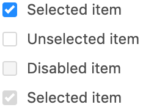

# Checkbox

## Props

| Name                    | Type    | Default value | Example |
| ----------------------- | ------- | ------------- | ------- |
| label \*                | string  |               |         |
| disabled                | boolean | false         |         |
| checked <sup>\* 1</sup> | boolean | false         |         |

\* _Required_

<sup>1</sup> The initial value must match the value of the variable used with `v-model`.

## Usage

Here's a quick overview on how the component displays with certain parameters.
For a more detailed overview, run the Storybook locally.

#### Examples

```
<Checkbox v-model="selected" :checked="selected" label="Selected item" />

<Checkbox v-model="unselected" :checked="unselected" label="Unselected item" />

<Checkbox v-model="disabledOff" :checked="disabledOff" label="Disabled item" :disabled="true" />

<Checkbox v-model="disabledOn" :checked="disabledOn" label="Selected item" :disabled="true" @input="someMethod"/>
```

will render:


