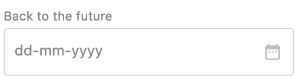
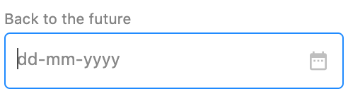
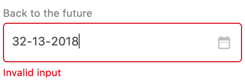
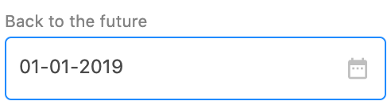
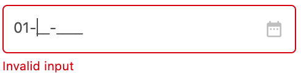
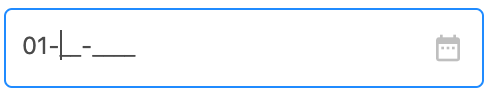

# DateInputField

## Props

| Name            | Type    | Default value | Example                                                     |
| --------------- | ------- | ------------- | ----------------------------------------------------------- |
| disabled        | boolean | false         |                                                             |
| placeholder     | string  | 'dd-mm-yyyy'  |                                                             |
| dataTest        | string  | ''            |                                                             |
| title           | string  |               |                                                             |
| value           |         | null          |                                                             |
| inputValidators | array   | []            | `[{ isInvalid: input => false, errorMessage: 'Optional' }]` |

## Implementation details

`DateInputField` wraps [`InputField`](InputField.md) providing:

- A default `inputMask` (`DATE_MASK`)
- A default `materialIcon`
- A default placeholder: **dd-mm-yyyy**. This can be overwritten.
- A default validation using the function `isValidDate` from `@/utilities/date-formatting`. It basically checks that the numbers for day and month make sense (So a date like **32-13-2018** would display a warning message). You can add additional validations on top of that if needed.

## Usage

Here's a quick overview on how the component displays with certain parameters.
For a more detailed overview, run the Storybook locally.

#### Important notes

You must use `v-model` on the component. Otherwise default validation will fail.

#### Examples

`<DateInputField v-model="date" title="Back to the future"/>`

will render:

## Known issues

- From the user perspective, as soon as they start writing a date they get an error message, even though they haven't yet finished entering the date:

  

  We need to change this so that users get the chance to finish entering a valid-so-far date before getting the error message:

  

- For other issues that might be relevant to this component, please refer to the **known issues** section on [`InputField`](InputField.md).
