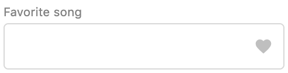

# InputField

## Props

| Name                      | Type                      | Default value | Example                                                     |
| ------------------------- | ------------------------- | ------------- | ----------------------------------------------------------- |
| disabled                  | boolean                   | false         |                                                             |
| placeholder               | string                    | ''            |                                                             |
| dataTest                  | string                    | ''            |                                                             |
| title                     | string                    |               |                                                             |
| value                     |                           | null          |                                                             |
| inputValidators           | array                     | []            | `[{ isInvalid: input => false, errorMessage: 'Optional' }]` |
| inputMask                 | array/func/boolean/object |               | `DATE_MASK` (from `@/components/input-fields/mask-regex`)   |
| materialIcon 1 | string                    |               | 'cloud' for the cloud icon                                  |
| textIcon 2     | string                    |               | '°C'                                                        |

1 _Icons are from [material icons](https://material.io/resources/icons). Just pass a string with the icon name. If both `materialIcon` and `textIcon` are passed to the component, `textIcon` takes precedence._

2 _Pass any string of length less than or equal to 2 to be used as an icon. For example '°C'. `textIcon` takes precedence over `materialIcon` if both are passed as props._

## Usage

Here's a quick overview on how the component displays with certain parameters.
For a more detailed overview, run the Storybook locally.

#### Important notes

When using `inputValidators`, also use `v-model` on the component. Otherwise, validation will fail.

#### Examples

`<InputField title="Lower temperature" placeholder="17.5" textIcon="°C"/>`

will render:

`<InputField title="Favorite song" materialIcon='favorite'/>`

will render

## Known issues

- Some material design icons are not displaying. Examples: _voice_over_off_, _eco_ and _supervised_user_circle_

- At the moment the `InputField` component and other components wrapping it rely on masks to limit the user input to the desired type (for example, using `DATE_MASK` on `DateInputField`). The UX team considers this to be **non user friendly**, meaning that we should allow the user to enter any value (for example _hallo_ in `MoneyInputField`) and show an error message for non-valid inputs.
