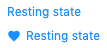

# Links

**LinkedText** component has pretty the same API as the **Button** one, but it will render a link (`<router-link>` if _to_ prop exists and `<a>` otherwise) by default.

In some cases it might be required that a link appears as button. For this an additional `category` attribute **and** the `role="button"` attribute must be added.

## Usage

```html
<LinkedText>Resting state</LinkedText>

<LinkedText :materialIcon="favorite">Resting state</LinkedText>
```

will render



```html
<LinkedText category="primary" role="button">Resting state</LinkedText>

<LinkedText category="primary" disabled role="button">Disabled state</LinkedText>
```

will render a primary button.
