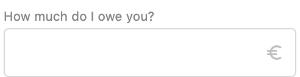

# MoneyInputField

## Props

| Name            | Type    | Default value | Example |
| --------------- | ------- | ------------- | ------- |
| disabled        | boolean | false         |         |
| dataTest        | string  |               |         |
| placeholder     | string  | ''            |         |
| title           | string  |               |         |
| value           | object  | null          |         |
| inputValidators | array   | []            |         |
| allowNegative   | boolean | false         |         |
| allowDecimal    | boolean | true          |         |

## Implementation details

`MoneyInputField` wraps [`NumericInputField`](NumericInputField.md) providing a default `materialIcon` for the euro symbol.

## Usage

#### Important notes

You must use `v-model` on the component. Otherwise default validation will fail.

_For more details, please refer to the usage section in the [InputField](InputField.md) notes._

#### Example

`<MoneyInputField title="How much do I owe you?"/>`

will render:

## Known issues

Refer to the **known issues section** for [NumericInputField](NumericInputField.md)
