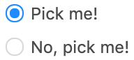

# RadioSet

## Props

| Name                | Type    | Default value | Example |
| ------------------- | ------- | ------------- | ------- |
| options<sup>1</sup> | array   |               |         |
| inline              | boolean | false         |         |

<sup>1</sup> _The `options` array should contain objects with the following properties:_

- `label`: String. Required.
- `value`: String, Boolean, Number. Should be the same as the type of the variable to which you bind the `RadioSet` using `v-model`. Required.
- `disabled`: Boolean. Default `false`

## Slots

You can pass in named slots to display below any radio option. The slot's `name` should match the option's `value`.

For example, if one of the options in the options array looks like this: `{ label: 'secret place', value: 'secret' }`

Then this slot would display below that radio option.

```
<RadioSet v-model="current" :options="options">
    <template v-slot:secret>
        <!-- some html -->
    </template>
</RadioSet>
```

## Usage

Here's a quick overview on how the component displays with certain parameters.
For a more detailed overview, run the Storybook locally.

#### Important notes

When an user selects a radio option, the variable referenced with `v-model` gets updated with that option's `value`.

#### Examples

Assuming `options = [{ label: 'Pick me!, value: true, checked: true }, { label: 'No, pick me!', value: false }]`

Then:

-----
`<RadioSet v-model="current" :options="options"/>`

will render:



-----

`<RadioSet v-model="current" :options="options" :inline="true"/>`

will render:


## Known issues

- **Slots on and off**. Ideally, the slot content of a given radio option would only show if that radio option is checked.
