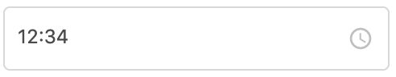

# TimeInputField

## Props

| Name            | Type    | Default value | Example                                                     |
| --------------- | ------- | ------------- | ----------------------------------------------------------- |
| disabled        | boolean | false         |                                                             |
| placeholder     | string  | 'hh:mm'       |                                                             |
| dataTest        | string  | ''            |                                                             |
| title           | string  |               |                                                             |
| value           |         | null          |                                                             |
| inputValidators | array   | []            | `[{ isInvalid: input => false, errorMessage: 'Optional' }]` |

## Implementation details

`TimeInputField` wraps [`InputField`](InputField.md) providing:

- A default `inputMask` (`TIME_MASK`)
- A default `materialIcon`
- A default placeholder: **hh:mm**. This can be overwritten.
- A default validation using the function `isValidHour` from `@/utilities/date-formatting`.
  It basically checks that the numbers for hour and minute make sense (So a time like **25:60** would display a warning message). You can add additional validations on top of that if needed.

## Usage

Here's a quick overview on how the component displays with certain parameters.
For a more detailed overview, run the Storybook locally.

#### Important notes

You must use `v-model` on the component. Otherwise default validation will fail.

#### Examples

`<TimeInputField v-model="pickupTime"/>`

Assuming there's a property `pickupTime` on the parent component whose value is `12:34`, this will render:

## Known issues

- For other issues that might be relevant to this component, please refer to the **known issues** section on [`InputField`](InputField.md).
